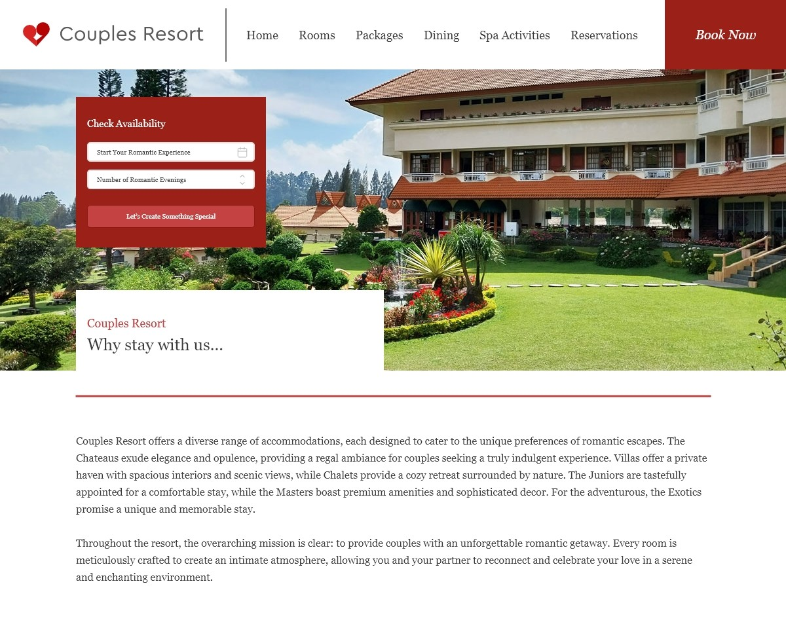

# FIP - Final Integrated Project - Level 1

**Objective:** This repo was created for the Final Integrated Project of the first term of the Interactive Media Design program. The project required the creation of two mobile web pages for the Couples Resort website. My choice of pages was the Rooms page and the Dining page. Both pages are linked to the menu, and functionalities were implemented based on an Adobe XD prototype.

## Installation
No installation required

## Usage
Just enjoy!

## Contributing
1. Fork it!
2. Create your feature branch: `git checkout -b my-new-feature`
3. Commit your changes: `git commit -am 'Add some feature'`
4. Push to the branch: `git push origin my-new-feature`
5. Submit a pull request :D

## History
November, 2023
December, 2023

## Credits
Jenifer Quelali Evangelista

## License
MIT